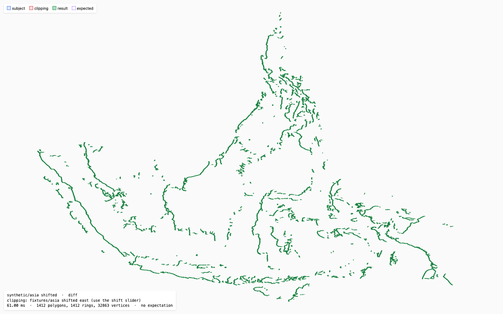

# Martinez-Rueda polygon clipping algorithm [](https://badge.fury.io/js/martinez-polygon-clipping)


## Details

The algorithm is specifically _fast_ and _capable_ of working with polygons of all types: multipolygons (without cascading),
polygons with holes, self-intersecting polygons and degenerate polygons with overlapping edges.

### Example

Play with it by [forking this Codepen](https://codepen.io/w8r/pen/MjgqMx)

```js
import * as martinez from 'martinez-polygon-clipping';
const gj1 = { "type": "Feature", ..., "geometry": { "type": "Polygon", "coordinates": [ [ [x, y], ... ] ]};
const gj2 = { "type": "Feature", ..., "geometry": { "type": "MultiPolygon", "coordinates": [ [ [ [x, y], ...] ] ]};

const intersection = {
  "type": "Feature",
  "properties": { ... },
  "geometry": {
    "type": "Polygon",
    "coordinates": martinez.intersection(gj1.geometry.coordinates, gj2.geometry.coordinates)
  }
};
```

### API

- **`.intersection(<Geometry>, <Geometry>) => <MultiPolygon>`**
- **`.union(<Geometry>, <Geometry>)        => <MultiPolygon>`**
- **`.diff(<Geometry>, <Geometry>)         => <MultiPolygon>`**
- **`.xor(<Geometry>, <Geometry>)          => <MultiPolygon>`**

`<Geometry>` is [GeoJSON](http://geojson.org/geojson-spec.html) [`'Polygon'`](http://geojson.org/geojson-spec.html#id4) or [`'MultiPolygon'`](http://geojson.org/geojson-spec.html#id7) <u>**coordinates**</u> structure.

The result is always `'MultiPolygon'` coordinates, `[]` if it is empty. Its rings are closed and oriented as [RFC 7946](https://datatracker.ietf.org/doc/html/rfc7946#section-3.1.6) requires: exterior rings counter-clockwise, holes clockwise.

`<Operation>` is an enum of `{ INTERSECTION: 0, UNION: 1, DIFFERENCE: 2, XOR: 3 }` in case you have to decide programmatically
which operation do you need

### Benchmarks

Operations per second, higher is better. Run `npm run bench` to reproduce: it benchmarks the built bundle against [JSTS](https://github.com/bjornharrtell/jsts), [polygon-clipping](https://github.com/mfogel/polygon-clipping) and [polyclip-ts](https://github.com/luizbarboza/polyclip-ts) (the engine behind `@turf/union` 7). All libraries produce the same result areas on these inputs.

| Benchmark | Martinez | JSTS 2.12 | polygon-clipping 0.15 | polyclip-ts 0.16 |
|---|---:|---:|---:|---:|
| Hole_Hole union (20 vertices) | **68,058** | 10,549 | 28,687 | 1,712 |
| Asia union (28k vertices) | **46.8** | 32.2 | 19.2 | 3.18 |
| States union (2.3k vertices) | **754** | 426 | 399 | 40.2 |
| Asia vs Asia shifted 0.05°: union | **16.2** | 5.29 | 6.06 | 0.97 |
| Asia vs Asia shifted 0.05°: difference | **16.0** | 5.25 | 5.11 | 0.72 |

Apple M3, Node 22.17. The "shifted" cases clip the Asia polygon against a copy of itself moved slightly east, so that nearly every edge intersects; `demo/cases.html` shows it with a slider for the shift.



*The difference with a larger 0.3° shift, to make the slivers visible (the benchmark uses 0.05°).*

### Features

The algorithm of Martinez et al. was extended to work with multipolygons without cascading.

### Demos

`npm run dev` starts the demos:

- `demo/index.html`: interactive map where you can edit the polygons.
- `demo/cases.html`: test case viewer. Pick any case from `test/genericTestCases` or `test/fixtures` and an operation to see the inputs, the computed result and, for generic test cases, whether it matches the expected result. Use ←/→ to step through cases, keys 1–5 to switch the operation, and F to fit the view. The selection is kept in the URL, so a case can be linked, e.g. `cases.html#generic%2Fissue155/xor`.

### Authors

- [Alexander Milevski](https://github.com/w8r/)
- [Vladimir Ovsyannikov](https://github.com/sh1ng/)

### Based on

- [A new algorithm for computing Boolean operations on polygons](http://www.sciencedirect.com/science/article/pii/S0965997813000379) (2008, 2013) by Francisco Martinez, Antonio Jesus Rueda, Francisco Ramon Feito (and its C++ code)

### Related projects

Other JavaScript implementations of the Martinez–Rueda–Feito algorithm:

- [polygon-clipping](https://github.com/mfogel/polygon-clipping) by Mike Fogel was forked from this
  repository in February 2018 (see its license) and developed separately since. It snaps coordinates
  and intersection points to previously seen values within floating-point precision, and caps the
  sizes of its internal structures as a guard against infinite loops. Latest release: 0.15.7
  (December 2023).
- [polyclip-ts](https://github.com/luizbarboza/polyclip-ts) by Luiz Barboza is a TypeScript fork of
  polygon-clipping, and so, indirectly, of this repository. It computes with arbitrary-precision
  decimals (bignumber.js) and is the engine behind `@turf/union` and the other Turf 7 boolean operations.

See [Benchmarks](#benchmarks) for how they compare in speed on the same inputs.

### License

The MIT License (MIT)

Copyright (c) 2018 Alexander Milevski

Permission is hereby granted, free of charge, to any person obtaining a copy of this software and associated documentation files (the "Software"), to deal in the Software without restriction, including without limitation the rights to use, copy, modify, merge, publish, distribute, sublicense, and/or sell copies of the Software, and to permit persons to whom the Software is furnished to do so, subject to the following conditions:

The above copyright notice and this permission notice shall be included in all copies or substantial portions of the Software.

THE SOFTWARE IS PROVIDED "AS IS", WITHOUT WARRANTY OF ANY KIND, EXPRESS OR IMPLIED, INCLUDING BUT NOT LIMITED TO THE WARRANTIES OF MERCHANTABILITY, FITNESS FOR A PARTICULAR PURPOSE AND NONINFRINGEMENT. IN NO EVENT SHALL THE AUTHORS OR COPYRIGHT HOLDERS BE LIABLE FOR ANY CLAIM, DAMAGES OR OTHER LIABILITY, WHETHER IN AN ACTION OF CONTRACT, TORT OR OTHERWISE, ARISING FROM, OUT OF OR IN CONNECTION WITH THE SOFTWARE OR THE USE OR OTHER DEALINGS IN THE SOFTWARE.
